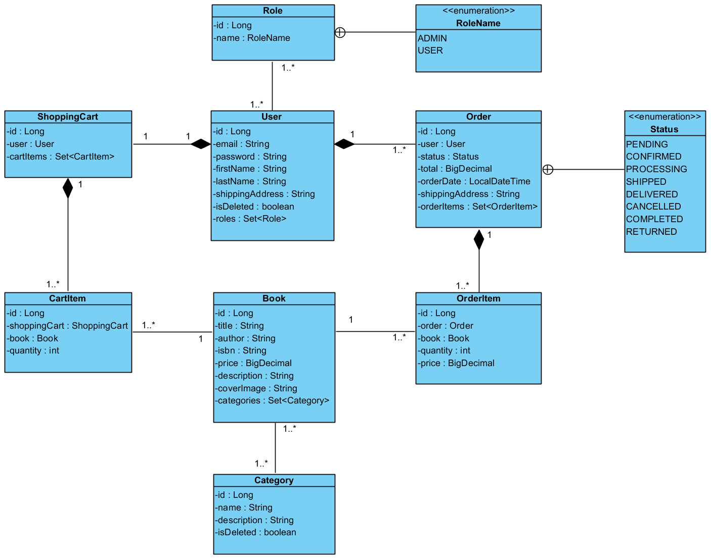

# 📚 Online Bookstore REST API

[](https://www.oracle.com/java/)
[](https://spring.io/projects/spring-boot)
[](https://docs.spring.io/spring-security/reference/servlet/oauth2/resource-server/jwt.html)
[](https://www.mysql.com/)
[](https://www.docker.com/)

Online Book Store REST API is a backend application that provides a comprehensive set of RESTful endpoints for core
online bookstore operations.

The system supports user registration and authentication, browsing and purchasing books, shopping cart management, and
order processing. It also includes administrative functionality for managing books, categories, and order statuses.

The application is designed following REST principles, role-based access control, and layered application architecture.

---

## 🧭 Table of Contents

- [✨ Key Features](#-key-features)
- [🛠️ Tech Stack](#-tech-stack)
- [⚙️ Architecture](#-architecture)
- [🧩 Core Business Entities](#-core-business-entities)
- [🌐 API Endpoints](#-api-endpoints)
- [📘 API Documentation](#-api-documentation)
- [🚀 Getting Started](#-getting-started)
- [🔬 Testing](#-testing)
- [🔐 Authentication & Authorization](#-authentication--authorization-1)
- [🧠 Challenges & Solutions](#-challenges--solutions)
- [🎬 API Demo](#-api-demo)
- [📄 License](#-license)

---

## ✨ Key Features

### 🔐 Authentication & Authorization

* User registration and login
* JWT-based authentication
* Role-based access control:

    * `ROLE_USER`
    * `ROLE_ADMIN`
* Access rules:

    * Public endpoints for authentication
    * User-only access for shopping cart and orders
    * Admin-only access for book, category, and order management

---

### 📚 Book & Category Management

* Create, update, and delete books (Admin)
* Create, update, and delete categories (Admin)
* Retrieve all books
* Retrieve book details by ID
* Search books by title
* Retrieve books by category

---

### 🛒 Shopping Cart

* Each authenticated user has a personal shopping cart
* Add books to the cart
* View cart contents
* Update cart item quantity
* Remove items from the cart

---

### 📦 Orders

* Place an order based on the current shopping cart
* View order history for the authenticated user
* View order details
* Update order status (Admin)

---

### 📘 Development & Documentation

* RESTful API design
* Layered application architecture
* Swagger / OpenAPI documentation
* Consistent request and response formats

---

## 🛠️ Tech Stack

| Category         | Technology                       |
|------------------|----------------------------------|
| Language         | Java 17+                         |
| Framework        | Spring Boot 3                    |
| Security         | Spring Security, JWT             |
| Persistence      | Spring Data JPA                  |
| Database         | MySQL                            |
| Migrations       | Liquibase                        |
| Documentation    | Swagger / OpenAPI                |
| Utilities        | Lombok, MapStruct                |
| Build Tool       | Maven                            |
| Testing          | JUnit 5, Mockito, Testcontainers |
| Containerization | Docker, Docker Compose           |

---

## ⚙️ Architecture

The application is built using a layered architecture that clearly separates responsibilities between different parts of
the system:

- **Controller layer**: Handles incoming htpps.

- **Service layer**: Contains business logic.

- **Repository layer**: Responsible for data access using Spring Data JPA.

- **Domain layer**: Represents the core business entities.

- **DTO layer**: Defines API request and response models.

- **Mapper layer**: Handles transformations between domain entities and API models.

#### 🔐 Security

Authentication and authorization are handled globally using **Spring Security** with **JWT-based authentication**,
providing **stateless** access control with no server-side sessions and ensuring secure access to protected
endpoints based on user roles and ownership of resources.

---

## 🧩 Core Business Entities

The application is built around the following core domain entities:

- **User** – application user who owns a `ShoppingCart` and places `Orders`
- **Role** – defines user permissions (`USER`, `ADMIN`)
- **Book** – represents a book available in the store (title, author, price, etc.)
- **Category** – groups books into logical sections
- **ShoppingCart** – an active cart associated with a `User`
- **CartItem** – a line item in the `ShoppingCart`, containing a `Book` and quantity
- **Order** – a placed order created from the `ShoppingCart`
- **OrderItem** – an item within an `Order`, containing a `Book`, quantity, and a price snapshot

### 📐 UML Class Diagram



---

## 🌐 API Endpoints

### 🔐 Authentication

Handles user registration and authentication.

```htpp
POST /api/auth/registration      - Register a new user
POST /api/auth/login             - Authenticate and receive JWT token
```

### 📚 Books

Public read access, admin-only for management.

```htpp
GET    /api/books           - Retrieve all books
GET    /api/books/{id}      - Retrieve book details
GET    /api/books/search    - Search books by author and/or category
POST   /api/books           - Create a new book        (ADMIN)
PUT    /api/books/{id}      - Update an existing book  (ADMIN)
DELETE /api/books/{id}      - Remove a book            (ADMIN)
```

### 🗂️ Categories

Public read access, admin-only for management.

```htpp
GET    /api/categories           - Retrieve all categories
GET    /api/categories/{id}      - Retrieve category details
POST   /api/categories           - Create a new category   (ADMIN)
PUT    /api/categories/{id}      - Update a category       (ADMIN)
DELETE /api/categories/{id}      - Remove a category       (ADMIN)
```

### 🛒 Shopping Cart

Shopping Cart management for the authenticated user.

```htpp
GET    /api/cart                 - Retrieve current user's cart
POST   /api/cart/items           - Add a book to the cart
PUT    /api/cart/items/{id}      - Update cart item quantity
DELETE /api/cart/items/{id}      - Remove an item from the cart
```

### 📦 Orders

Order management for the authenticated user.

```htpp
POST   /api/orders           - Create an order from the current cart
GET    /api/orders           - Retrieve user's order history
GET    /api/orders/{id}      - Retrieve order details
```

---

## 📘 API Documentation

The API is documented using **Swagger / OpenAPI** and is available via **Swagger UI**.

Once the application is running, you can explore and test all endpoints directly in your browser:

```text
http://localhost:8080/api/swagger-ui/index.html
```

Swagger UI allows you to:

- Browse all available endpoints
- View request and response schemas
- Try out API calls with real data

---

## 🚀 Getting Started

### ✅ Prerequisites

Make sure you have installed:

- [Git](https://git-scm.com/install/)
- [Docker Desktop](https://www.docker.com/products/docker-desktop/)

> ⚠️ Java and Maven are not required — the project uses the Maven Wrapper and runs in Docker.

---

### 1️⃣ Clone the Repository

```bash
  git clone https://github.com/your-username/book-store.git
  cd book-store
```

### 2️⃣ Configure Environment Variables

This project uses environment variables for sensitive configuration.

1. Copy `.env.template` to `.env`:

```bash
  cp .env.template .env
```

2. Open the `.env` file and set your values:

| Variable                | Description             | Example         |
|-------------------------|-------------------------|-----------------|
| `MYSQLDB_ROOT_PASSWORD` | Root password for MySQL | `rootpass`      |
| `MYSQLDB_DATABASE`      | Database name           | `book_store_db` |
| `MYSQLDB_USER`          | Database user           | `appuser`       |
| `MYSQLDB_PASSWORD`      | Database password       | `apppass`       |
| `MYSQL_LOCAL_PORT`      | Local MySQL port        | `3306`          |
| `MYSQL_DOCKER_PORT`     | Internal MySQL port     | `3306`          |
| `SPRING_LOCAL_PORT`     | Local API port          | `8088`          |
| `SPRING_DOCKER_PORT`    | Internal API port       | `8080`          |
| `DEBUG_PORT`            | IDE debug port          | `5005`          |

### 4️⃣ Build and Run the Application

```bash
  docker compose up --build
```

This will:

- build the Docker image for your Spring Boot application
- start the application and MySQL containers
- expose the API on http://localhost:${SPRING_LOCAL_PORT}/api

### 5️⃣ Stop the Application

Stop the application and remove the containers:

```bash
  docker-compose down
```

### 📘 Swagger / OpenAPI

The project includes Swagger/OpenAPI documentation. Once the app is running, you can explore and test all API endpoints
directly from the browser:

```htpp
http://localhost:${SPRING_LOCAL_PORT}/api/swagger-ui/index.html
```

---

## 🔬 Testing

All tests in this project are fully isolated to ensure they are reliable and do not interfere with each other or any
external database.

### Unit Tests

We use **JUnit 5** and **Mockito** to test services and components independently.  
This allows us to verify the business logic without starting the full application or connecting to a real database.

### Integration Tests

For testing the **controller layer and database interactions**, the project uses **Testcontainers**.  
During the test run, Testcontainers starts a temporary **MySQL container**, so the API is tested against a real database
environment while remaining completely isolated and repeatable.

You can run all tests using the Maven Wrapper and Docker:

```bash
  ./mvnw test
```

### CI/CD Integration

All tests are automatically executed as part of the CI pipeline.
This guarantees that every change pushed to the repository is verified for correctness and stability before deployment.

---

## 🔐 Authentication & Authorization

The application uses **JWT (JSON Web Token)** for stateless authentication and **Spring Security** for authorization.

All secured endpoints require a valid JWT token to be provided in the `Authorization` header.

---

### 🔑 Authentication Flow

1. **Register a new user**

   ```htpp
   POST /auth/register
   ```

2. Login with credentials (email & password)

   ```htpp
   POST /auth/login
   ```

   If authentication is successful, the server returns a JWT token:

    ```json
   {
   "token": "eyJhbGciOiJIUzI1NiIsInR5cCI6IkpXVCJ9..."
   }
   ```

3. Access secured endpoints
   у
   The token must be included in every protected request:

   ```htpp
   Authorization: Bearer <your-token>
   ```

### 🛂 Authorization & Roles

Access to endpoints is controlled using **role-based authorization** with Spring Security.

#### Available roles

##### `ROLE_USER`

- View books
- View categories
- Manage own cart
- Create and view own orders

##### `ROLE_ADMIN`

- Manage books (CRUD)
- Manage categories (CRUD)
- Manage order statuses

---

## 🧠 Challenges & Solutions

During the development of this project, several real-world backend challenges were identified and solved.  
Each of them contributed to a deeper understanding of Spring Boot, security, Docker, and enterprise-level API design.

### 🔐 Security & Access Control

- **Challenge:**  
  Building a secure API without server-side sessions while maintaining clear role-based access control.
- **Solution:**  
  Implemented **JWT-based authentication** with Spring Security.  
  Authentication is fully stateless — every request is validated via a JWT filter, and access is controlled using
  roles (`USER`, `ADMIN`).

### ⚙️ Layered Architecture & Separation of Concerns

- **Challenge:**  
  Keep business logic out of controllers and maintain a clean, scalable codebase.
- **Solution:**  
  Structured the project into a layered architecture (Controller → Service → Repository) with DTO mapping for API
  communication, making the system easier to maintain and evolve.

### 🔬 Reliable Testing Strategy

- **Challenge:**  
  Writing tests that are isolated, repeatable, and as close to production as possible.
- **Solution:**
    - Used **JUnit & Mockito** for unit testing business logic.
    - Used **Testcontainers** for integration tests to run against a real MySQL database inside Docker, ensuring
      realistic and fully isolated test environments.

### 🐳 Docker & Build Optimization

- **Challenge:**  
  Prevent unnecessary rebuilds and repeated dependency downloads during Docker image creation.
- **Solution:**  
  Optimized the Dockerfile by downloading dependencies separately from the source code. This enables Docker to cache the
  dependency layer, reducing build times when the source code changes.

Real-world backend development principles were applied to address these challenges, resulting in a reliable and
maintainable API that demonstrates practical skills in **Spring Boot, security, testing, and system design**.

---

## 🎬 API Demo

A short video showcasing the core features of the Online Book Store REST API.

👉 [Watch the demo](https://www.loom.com/share/8f5fed37903b4c0a9f67f26f9883d8e0)

---

## 📄 License

This project was created for **educational and portfolio purposes**.  
The source code may be used as a reference for learning and personal projects.

